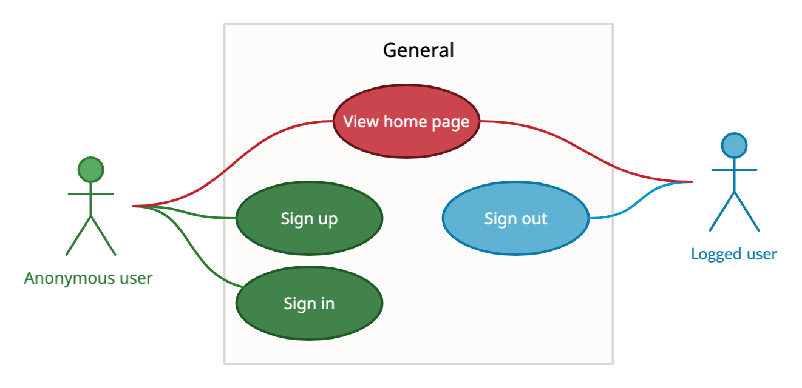
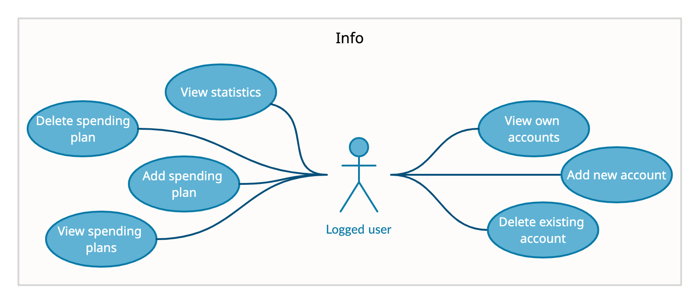
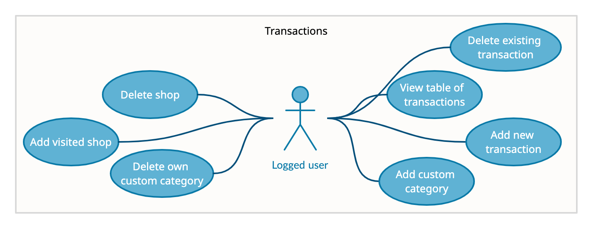

# Project Specification

Finance Lead is an environment for organizing, planning and analyzing finances, in which it is very easy to work due to a convenient and simple interface.

This software product can be useful for different categories of people.

**Roles**: Anonymous User, Logged User.

| Role          | Description                                                    |        
| ------------- | -------------------------------------------------------------- |
| Anonymous User| Anonymous user can sign up, sign in, and see information page. |
| Logged User   | Logged user can see and manage their transactions, accounts, spending plans, custom categories and shops. Also they can see statistics in the form of tables and charts that will help the user to analyze their costs and revenues.|

## Use case diagrams

To see the project architecture, click [here](./architecture.md).